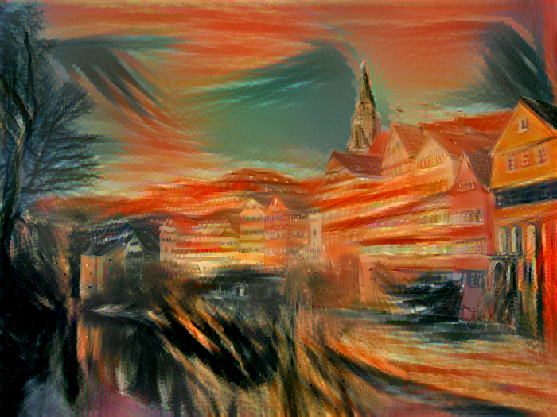
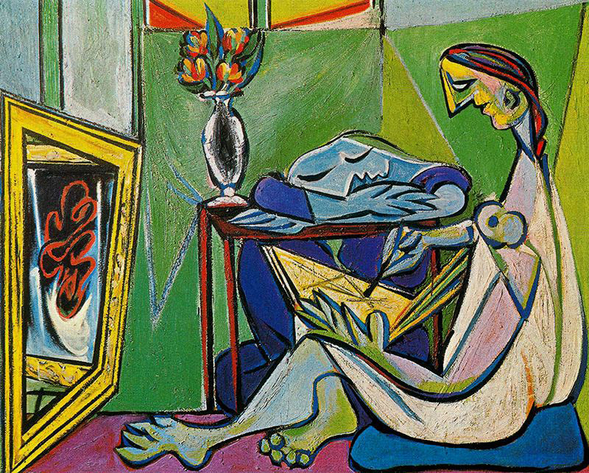

# Artistic-Style-Transfer

# Info
---
My undergraduate thesis project. In this project I implemented style transfer by combining the content of one image with the style of another image. This project contains the implementation of three different papers: [A Neural Algorithm of Artistic Style](https://arxiv.org/abs/1508.06576), [Deep Photo Style Transfer](https://arxiv.org/abs/1703.07511) and [Perceptual Losses for Real-Time Style Transfer and Super-Resolution](https://arxiv.org/abs/1603.08155).

# Results
---
### A Neural Algorithm of Artistic Style

### Deep Photo Style Transfer
### Perceptual Losses for Real-Time Style Transfer and Super-Resolution
